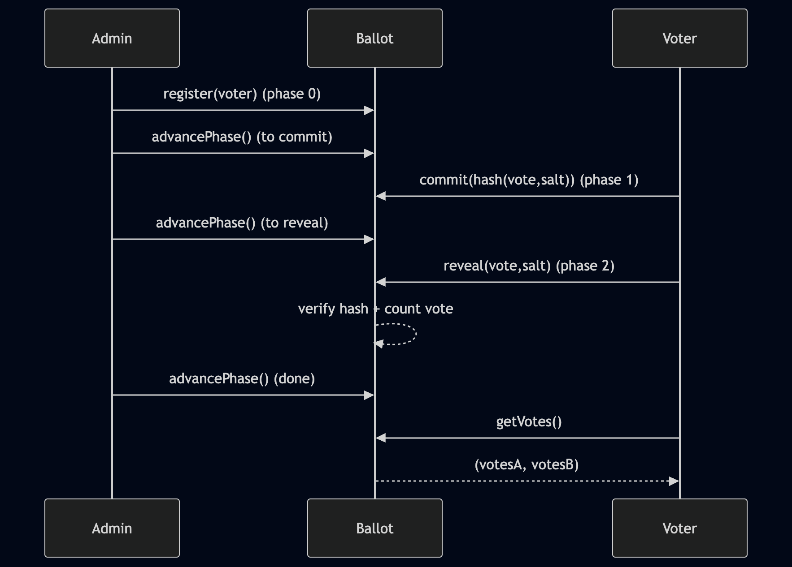

# Ballot on Arbitrum Stylus

A commit-reveal voting contract on Stylus. An admin registers 5 voters, who commit hashed votes for candidate A or B, then reveal. The admin goes and advances the multiple phases, and tallies the results.

Here's a sequence diagram:



Each voter is supposed to know a secret (salt) that they use to hash their vote before committing. Ofc in real life this wouldn't be a great ballot, but that's not the point here anyway

## What this teaches

- **`StorageMap`** - the Stylus equivalent of Solidity's `mapping`. Used here to track registered voters, stored commit hashes, and who has revealed.
- **Phase-based access control** - the contract uses a `phase` integer (0=setup, 1=commit, 2=reveal, 3=done) to gate which functions can be called when. In Solidity you'd probably use modifiers for this. The Stylus way is to use `assert_eq!` checks.
- **On-chain hashing with `keccak`** - imported from `stylus_sdk::crypto::keccak`. Used during reveal to verify that the voter's claimed vote + salt actually matches the hash they committed earlier.
- **Commit-reveal pattern** - the whole point of this contract.

## How commit-reveal works

You can't keep secrets on a public blockchain because every transaction is visible. So if voters just submitted their vote directly, everyone could see how others voted and change their mind (or worse, front-run).

Commit-reveal fixes this in two steps: first you submit a hash of your vote (commit), then after everyone has committed, you submit the actual vote + the secret salt you used to create the hash (reveal). The contract checks that the hash matches. This way nobody can peek at votes during the commit phase.

This is a toy though. There's no penalty for not revealing (so you could grief by committing and then ghosting), and the admin has way too much power (they control phase transitions), and there's no minimum quorum. 

Real voting contracts are way more involved, they require voter privacy and private tallying. One would use zero-knowledge proofs or maybe full homomorphic encryption to tally votes without revealing individual votes.

## Solidity side-by-side

There's an equivalent Solidity version at [`src/solidity/Ballot.sol`](src/solidity/Ballot.sol). Both contracts produce the same ABI. Key differences:

| Stylus (Rust) | Solidity |
|---|---|
| `StorageMap<Address, StorageBool>` | `mapping(address => bool)` |
| `StorageMap<Address, StorageFixedBytes<32>>` | `mapping(address => bytes32)` |
| `assert_eq!(caller, admin, "only admin")` | `require(msg.sender == admin, "only admin")` |
| `keccak(preimage)` (manual 64-byte buffer) | `keccak256(abi.encode(vote, salt))` |
| Manual phase checks with `assert_eq!` | Same. Kept inline instead of modifiers so both versions read the same way |

## How the demo works

**`make setup`** deploys the ballot contract via `cargo stylus deploy`, registers 5 voters, and advances to the commit phase. Writes addresses to `.config`.

**`make demo`** runs the full voting flow:

1. **Commit** - each of the 5 voters generates a random salt, hashes their vote with it (`keccak256(abi.encode(vote, salt))`), and submits the hash. Voters 1, 3, 5 vote for A. Voters 2, 4 vote for B.
2. Admin advances to reveal phase
3. **Reveal** - each voter submits their actual vote + salt. The contract verifies the hash matches.
4. Admin advances to done
5. **Tally** - calls `getVotes()`, prints the result: 3 for A, 2 for B. Sorry B, you were doomed to lose this one.

Each transaction prints an Arbiscan link, which is why I recommend using a testnet.

## Quick start

```bash
make -C ballot setup   # deploy, register voters, advance to commit phase
make -C ballot demo    # run full commit-reveal-tally flow
```
