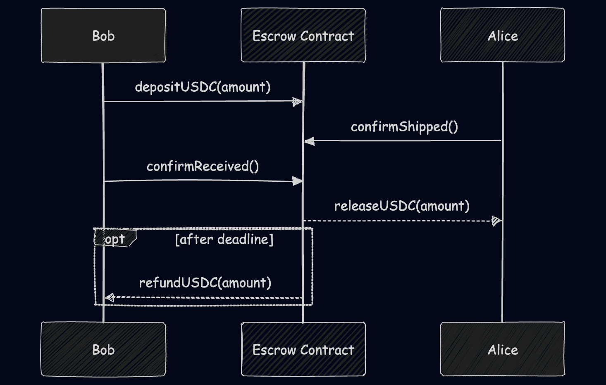

# Escrow on Arbitrum Stylus

If you're new to Stylus, start here. This is a minimal escrow smart contract written in Rust, compiled to WASM, and deployed to Arbitrum Sepolia via [Stylus](https://docs.arbitrum.io/stylus/gentle-introduction).

Demonstrates the full escrow flow: deposit, confirm shipment, confirm receipt.

Here's a sequence diagram:



There's a setup phase that deploys a mock ERC-20 (USDC) token on a arbitrum sepolia testnet. Once you run the `make setup` step, that will show in a `.config` file along with addresses and other stuff.

## What this teaches

- **Calling another contract from Stylus** - the escrow needs to move ERC-20 tokens around. In Solidity you'd just write `IERC20(addr).transferFrom(...)`. In Stylus you define the interface with `sol_interface!` and then call it the same way
- **Storage types** - Solidity has `address`, `uint256`, `bool` built in. Stylus compiles to WASM, so you use `StorageAddress`, `StorageU256`, `StorageBool` from the SDK instead. They map 1:1 to the same EVM storage slots.
- **`self.vm()`** - this is how you get at things like `msg.sender` and `address(this)`. In Solidity those are global because again, _solidity is made for the EVM_. In Stylus Rust you need to pull them from the VM context.

## Solidity side-by-side

There's an equivalent Solidity version at [`src/solidity/Escrow.sol`](src/solidity/Escrow.sol). Both contracts produce the same ABI and do the same thing. Key differences:

| Stylus (Rust) | Solidity |
|---|---|
| `sol_interface! { interface IERC20 { ... } }` | `interface IERC20 { ... }` |
| `StorageAddress`, `StorageU256`, `StorageBool` | `address`, `uint256`, `bool` |
| `self.vm().msg_sender()` | `msg.sender` |
| `self.vm().contract_address()` | `address(this)` |
| `IERC20::new(addr).transfer(&vm, Call::new_mutating(self), ...)` | `IERC20(addr).transfer(...)` |
| `Result<(), Vec<u8>>` for fallible functions | `require()` / `revert()` |

## How the demo works

**`make setup`** deploys a MockERC20 (fake USDC) to Arbitrum Sepolia using Foundry, mints 100k tokens to the buyer, and writes the contract address to `.config`.

**`make demo`** deploys the escrow contract, then runs the full flow:

1. Buyer approves the escrow contract to spend their USDC
2. Buyer calls `deposit()` - tokens move from buyer to the escrow contract
3. Seller calls `confirmShipped()` - marks the item as shipped
4. Buyer calls `confirmReceived()` - tokens release from escrow to seller

Each transaction prints an Arbiscan link so you can see it on-chain.

## Quick start

`cp .env.example .env` and then fill the BUYER_PK and SELLER_PK, they both should have some sETH. Add a custom RPC if you're being rate limited or something.

```bash
make setup             # deploy mock USDC, mint tokens, write .config
make demo              # deploy escrow, run the full flow
```

Each transaction prints an Arbiscan link. I had some fun verifying the escrow contract on Arbiscan using [these instructions](https://docs.arbitrum.io/stylus/how-tos/verifying-contracts-arbiscan), but AFAIK you can't do it with forge and it doesn't seem to support contracts written with Stylus version >0.6.1 yet
